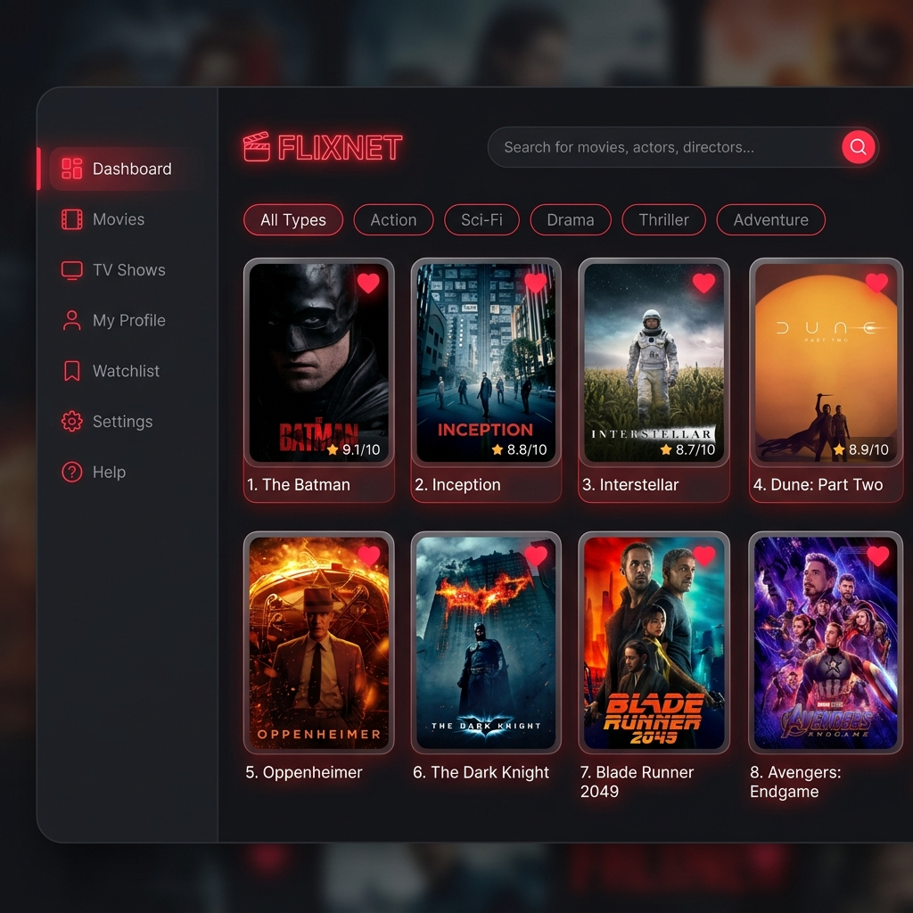

# Web Developer Technical Test - FlixNet Movie Discovery App

A premium, modern dark-themed Single Page Application (SPA) built using **Laravel 5.8** & **Vue.js 2** for movie discovery and managing favorite titles. It integrates securely with the **OMDb API** through a backend proxy to prevent API key exposure.

---

## 📸 Application Screenshot



---

## 🛠️ Architecture & Design Decisions

This application adopts a hybrid **Single Page Application (SPA)** and **Model-View-Controller (MVC)** architecture:

1.  **Stateless API Authentication (JWT):**
    The app uses token-based stateless authentication. When users submit credentials, the backend generates a secure JSON Web Token (JWT) using the HS256 algorithm. The token is stored in the browser's `localStorage` and sent with subsequent requests inside the `Authorization: Bearer <token>` header.
2.  **Backend Proxy Layer for OMDb API:**
    To guarantee security, the client never talks to the OMDb API directly. Instead, all requests pass through a backend controller (`MovieController.php`) which appends the secret `OMDB_API_KEY` stored securely in the server `.env` file. This architecture protects the key from being leaked or intercepted.
3.  **Modern Component-driven UI:**
    Built as a single-page app utilizing Vue.js 2 mounted on a Blade layout. It uses:
    *   **Intersection Observer API** for custom implementation of **Lazy Image Loading** (delaying image loading until it enters the viewport, displaying a shimmering placeholder transition).
    *   **Infinite Scrolling** for seamless pagination on the search page, triggering subsequent pages dynamically as the user scrolls.
    *   **Reactive Localization (ID / EN)**: Interactive language switcher using a client-side reactive translations dictionary for static elements.
4.  **Database Relationships (Favorites System):**
    Features a relational database setup where the `users` table has a `hasMany` relationship with the `favorites` table, allowing each user to securely save and remove their preferred movies.

---

## 📚 Libraries & Dependencies Used

### Backend (PHP/Laravel 5.8)
*   **`tymon/jwt-auth` (v1.0.x):** For issuing, refreshing, and validating JSON Web Tokens (JWT).
*   **`fideloper/proxy`:** For tracking headers when hosted behind load balancers or proxies.
*   **`laravel/tinker`:** Interactive command line shell for testing PHP code.

### Frontend (JavaScript/Vue.js 2)
*   **`vue` (v2.5.x):** Progressive framework for rendering the SPA view.
*   **`axios` (v0.19.x):** For making asynchronous HTTP requests with token authorization headers.
*   **`bootstrap` (v4.1.x):** Used for layout utilities, combined with bespoke modern Vanilla CSS for rich glassmorphism aesthetics.
*   **`laravel-mix` (v4.0.x):** Webpack wrapper for building and optimizing compiled JS and CSS assets.

---

## 🚀 How to Run Locally

### Prerequisites
*   Docker & Docker Compose

### Installation Steps

1.  **Clone the project** and navigate to the directory.
2.  **Configure environment variables:**
    Copy the example file to `.env`:
    ```bash
    cp .env.example .env
    ```
    Open `.env` and set your OMDb API Key:
    ```env
    OMDB_API_KEY=d63a56d9
    ```
3.  **Spin up the Docker container:**
    ```bash
    docker-compose up -d
    ```
4.  **Install Composer Dependencies (Inside Container):**
    ```bash
    docker exec laravel5-app composer install
    ```
5.  **Run Database Migrations & Seeds:**
    ```bash
    docker exec laravel5-app php artisan migrate:fresh --seed
    ```
    *This creates the `users` and `favorites` tables and seeds the required technical test user.*

6.  **Access the Application:**
    Open your browser and visit:
    [http://localhost:8000](http://localhost:8000)

---

## 🔑 Login Kredensial

*   **Username:** `aldmic`
*   **Password:** `123abc123`

---

## 🔗 Project Links

*   **Source Code (Local):** [App Repository](file:///Users/novalh/works/projects/recruitments/aldmic)
*   **Demo URL:** `http://localhost:8000` (or your deployed server IP/domain)
